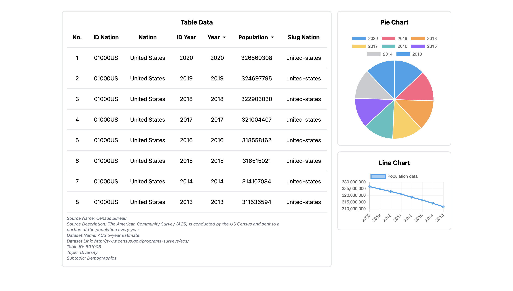

# noLimit-TechnicalTest

## Screenshot

### Description:

This repository contains a React application that displays data in a table format and visualizes it using Pie and Line charts. The application fetches data from an external source and allows users to sort the table by year and population. It also provides additional information about the data source.

#### Features:

- Table view with sortable columns (Year and Population).
- Pie chart visualization of population data.
- Line chart visualization of population data over the years.
- Information about the data source.

##### Contacts:

Muhammad Fajar Irfan - m.fajarirfan@gmail.com
